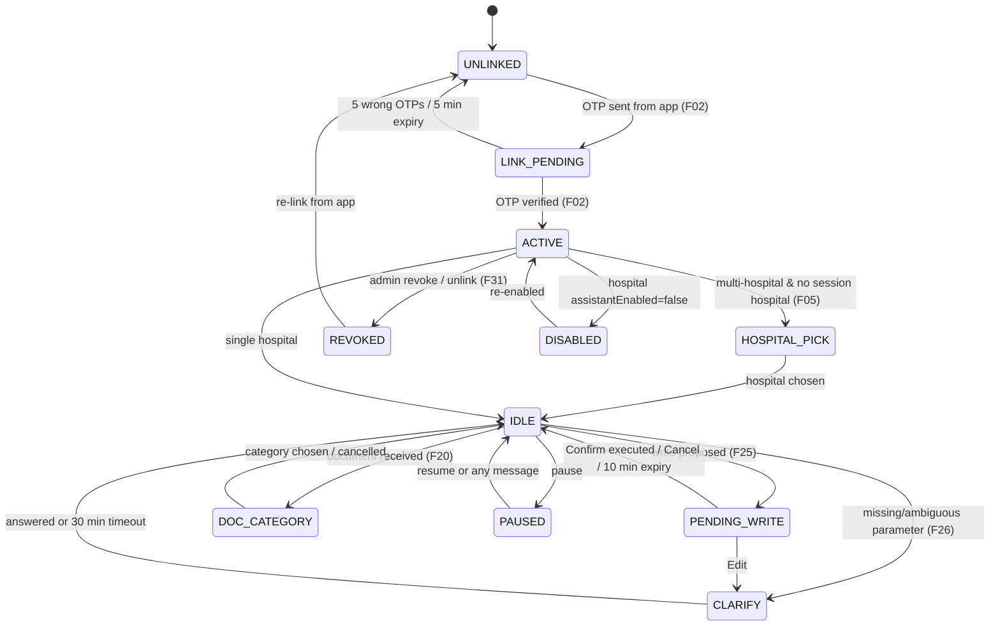

# Medoc WhatsApp Assistant — Conversation Workflow

Status: DRAFT v1 · 2026-09-04 · Companion files: `design.md`, `decisions.md`, `implementation.md` · Interactive showcase: `workflow.html` (published artifact)

This document is the complete conversational contract: every state, flow, menu, button, system message, notification, and error the assistant can produce, for every role. Engineers implement from it; the eval gold set is derived from it; the Meta template submissions are copied from §8.

Grounding: HPlus exposes 777 permissioned routes across 46 modules (`route-hash-map.json`); phase 1 covers `patient` (21), `appointment` (26), `ipd` (87, subset), `todo` (6), `myAttendance` (5), `workforce` (32), `hr` (148, self-service subset), `newInventory` (49), `labsTests` (63, reads), `radiology` (43, reads), `newFinance` (9, reads), `bills` (57, reads), `prescription` (1). Vigil roles are `Doctor`, `Nurse`, `Admin`, `Employee` (`ipdModel.ts:407`) and Vigil is **read-only** for the bot (Decision 19).

---

## 0. How to read this document

| Notation | Meaning |
|---|---|
| `U:` | user message (text, button tap, list pick, media) |
| `B:` | bot message |
| `B[btn: A · B · C]` | interactive **reply buttons** (max 3, title ≤ 20 chars) |
| `B[list: …]` | interactive **list message** (max 10 rows across ≤ 10 sections, row title ≤ 24, description ≤ 72, button label ≤ 20) |
| `B[tpl: name]` | approved **template** (only way to message outside the 24-hour window) |
| `B[doc]` / `B[img]` | document / image message |
| `→ tool` | HPlus/Vigil call the executor makes, as the user |
| `⟂ gate` | deterministic guard that ran in code before any model or HTTP call |
| `MSG-xxx` | message id in the catalogue (§8) |
| `{var}` | substituted value |

Every bot message exists in EN and HI; regional variants (Marathi, Tamil, Telugu, Kannada, Bengali, Gujarati per owner Q6) are generated by the model for free-form replies and pre-approved per language for templates.

---

## 1. Channel primitives and hard limits (Meta Cloud API)

| Primitive | Limit we design to | Our rule |
|---|---|---|
| Text | 4096 chars | Bot replies ≤ 900 chars; lists beyond 8 items are paginated with "Show more" |
| Reply buttons | 3 per message, 20 chars each | Reserved order: **primary · secondary · Cancel** |
| List message | 10 rows total, section titles ≤ 24 | Menus never exceed 9 rows + "Something else" |
| Template | Category UTILITY; approved per language | Used only for bot-initiated messages outside the 24-h window (§9) |
| Media in | image ≤ 5 MB, document ≤ 100 MB, audio ≤ 16 MB | Larger → MSG-E11 |
| Media out | document by link (signed read URL, 15 min) | Never re-upload PHI to Meta media store when a link will do |
| Reactions | 👍 👎 on any bot message | Feed the eval set (§7 F32) |
| Formatting | `*bold*`, `_italic_`, `~strike~`, ``` `mono` ```, bullets via `•` | No markdown tables; use aligned lines |
| Numeric fallback | — | Every button/list also accepts its number typed ("1", "2") and its label text |

Language rule: reply in the language of the **last user message**; a one-word command ("menu") keeps the current language. Script is respected (Hindi in Latin script → reply in Latin-script Hindi; Devanagari → Devanagari).

Time rule: all times in the hospital's timezone (`Asia/Kolkata`), 12-hour with am/pm, dates as `Mon 8 Sep`.

PHI rule: patient name + UHID may appear in replies to permitted staff; phone numbers are masked (`98xxxx4410`) unless the user's permission includes `patient.getPatientById.view` and they ask explicitly.

---

## 2. Global grammar (available in every state)

| Command (EN / HI / synonyms) | Effect | Notes |
|---|---|---|
| `menu` / `मेनू` / "options", "what can you do" | F06 main menu for the role | Keeps pending action alive |
| `help` / `मदद` / "?" | F07 help | |
| `cancel` / `रद्द` / "nahi", "stop that" | Cancels the pending action (if any), else "Nothing to cancel" | MSG-W05 / MSG-W06 |
| `confirm` / `हाँ` / "yes", "ok", "haan", "kar do" | Confirms the pending action (equivalent to the Confirm button) | Only within 10 min (F25) |
| `switch` / "switch hospital" / "दूसरा अस्पताल" | F24 hospital picker (multi-hospital users only) | Single-hospital users get MSG-I09 |
| `language` / "hindi mein bolo" / "english please" | F23 pin reply language for the session | |
| `status` / "what's pending" | Shows pending action, open tasks count, linked hospitals | MSG-I10 |
| `pause` / "don't message me" | Suppresses reminders/notifications until `resume` | MSG-I11 |
| `unlink` / "remove my number" | F31 unlink with confirmation | |
| `privacy` / "delete my data" | F31 data statement + instructions | |
| number `1–9` | Selects the corresponding row/button of the **last** interactive message | |

Interruption rules
1. A new intent while a write is **pending** does not cancel it. The bot answers the new intent and appends `_(1 action still pending — reply confirm or cancel)_` (MSG-W07).
2. A pending action expires 10 minutes after creation (T10). Confirm after expiry → MSG-W04.
3. Only one pending action per conversation. A second write proposal replaces the first **only after** the user cancels or it expires; otherwise → MSG-W08.
4. Clarification questions (F26) time out silently after 30 minutes; the next message starts fresh.
5. Any message from a **revoked** or **disabled** number gets exactly one MSG-E01/E02 per 24 h, then silence (no cost, no loop).

---

## 3. Roles, personas, and what each sees

Axon RBAC is per-hospital and runtime-editable, so the bot never reasons from a role *name*; it reasons from the **permission set** returned by `/auth/me`, expanded through `permission-index.json`. Personas below are the reference set used in this document, the prototype, and the eval gold set. A real hospital's roles will differ; the menu builder (§4) derives the menu from permissions, not from these names.

| # | Persona | Hospital role | Phase-1 modules (permission families) | Can write | Supervises |
|---|---|---|---|---|---|
| P1 | Sunita Rao | Hospital super_admin | wildcard | everything | everyone (audit) |
| P2 | Dr. Arjun Sharma | Consultant, Medicine | patient, appointment, ipd, prescription, labsTests (view), radiology (view), todo, myAttendance, workforce.leave (self) | prescriptions, appointment complete, IPD notes/vitals, tasks, leave | own OPD staff (todo team) |
| P3 | Priya Nair | Ward nurse, **2 hospitals** | patient (view), appointment (view), ipd (vitals, beds, drug orders view), todo, myAttendance, workforce.leave (self), newInventory (view + indent create) | vitals, tasks, leave, indent | — |
| P4 | Kiran Desai | Front desk / receptionist | patient (create, search, update), appointment (book, reschedule, cancel, slots, token), bills (view), todo, myAttendance | patients, appointments, tasks | — |
| P5 | Imran Shaikh | Pharmacist | newInventory (view, indent), prescription (view), bills.pharmacy (view), todo, myAttendance | indent, tasks | — |
| P6 | Meena Pillai | Lab technician | labsTests (orders, reports, status update), patient (view), todo, myAttendance | report status, tasks | — |
| P7 | Anjali Mehta | HR manager | hr (self-service + approvals), workforce (leave.handle, roster, attendance summary), todo, myAttendance | leave approve/reject, roster, tasks | department (todo team, action items) |
| P8 | Rahul Verma | Accountant | newFinance (view), bills (view), expense (view), newInventory (view), todo, myAttendance | tasks | — |
| P9 | Vikram Joshi | Store in-charge | newInventory (full: items, indents approve, GRN), todo, myAttendance | indent approve/reject, GRN receive, tasks | store staff |
| P10 | Ravi Kumar | Vigil floor nurse (no Axon login) | Vigil reads: my duty, my tasks, ward IPD list; writes only if an HPlus employee record with permissions exists | tasks (if HPlus perms) | — |
| P11 | Any of the above + `todo.getTasksByCreatorId` + `hr.addSupervisor` link | Supervisor overlay | adds "Team" scope to tasks and action items | | their reports |
| P12 | Unknown number | not linked | — | — | — |
| P13 | Revoked / hospital disabled | — | — | — | — |

Permission → menu derivation (§4): a module appears in the menu when the user holds **≥ 1 reviewed tool** in it; a row is a *write* only when the specific write permission is present. The catalogue's `kind` (`read` / `write`) is the source of truth; the model never decides what is a write.

---

## 4. Conversation state machine



Session facts held per conversation: `hospitalId` (chosen), `language`, `pendingActionId`, `clarifyContext`, `lastInteractiveMap` (number → row id), `pausedUntil`, `windowOpenUntil` (24-h), `dailyCapRemaining`.

---

## 5. Menus (interactive list messages)

Menus are built at request time from the permission set. Below are the reference menus for each persona; the builder picks rows in this priority order and stops at 9, then appends the fixed last row.

### 5.1 Row library (ids are stable; used by the eval set)

| Row id | Title (≤ 24) | Description (≤ 72) | Needs (any of) | Kind |
|---|---|---|---|---|
| `m.patient.find` | Find a patient | Search by name, UHID or phone | `patient.getPatientsBySearch.view` | read |
| `m.patient.add` | Register a patient | New OPD registration | `patient.addPatients.create` | write |
| `m.appt.today` | Today's OPD | Appointments by doctor or all | `appointment.fetchAppointments.view` | read |
| `m.appt.mine` | My schedule | Your appointments today / tomorrow | `appointment.fetchAppointments.view` + doctor | read |
| `m.appt.book` | Book appointment | Pick doctor, date, slot | `appointment.addAppointment.create` | write |
| `m.appt.slots` | Free slots | Next available slots for a doctor | `appointment.getAvailableSlots.view` | read |
| `m.ipd.beds` | Ward & beds | Occupancy by ward | `ipd.countOccBed.view` | read |
| `m.ipd.patient` | IPD patient | Details, vitals, orders for a bed | `ipd.details.getIPDAllDetails.view` | read |
| `m.ipd.vitals` | Record vitals | BP, HR, SpO₂, temp for a bed | `ipd.addVitals.create` | write |
| `m.rx.last` | Last prescription | For a patient | `prescription.*.view` | read |
| `m.task.mine` | My tasks | Open tasks assigned to you | `todo.getTasksByAssigneeId.view` | read |
| `m.task.team` | Team tasks | Tasks you created or supervise | `todo.getTasksByCreatorId.view` | read |
| `m.task.new` | New task | Assign to a colleague with a due time | `todo.add.create` | write |
| `m.att.mine` | My attendance | This month's punches and duties | `myAttendance.getByEmpId.view` | read |
| `m.att.roster` | Duty roster | Your shifts this week | `workforce.dutyRoster.getMyDutyRoster.view` | read |
| `m.leave.balance` | Leave balance | Casual, sick, earned | `workforce.leave.getLeaveBalances.view` | read |
| `m.leave.apply` | Apply for leave | Type, dates, reason | `workforce.leave.applyLeave.create` | write |
| `m.leave.pending` | Pending leave requests | Approve or reject | `workforce.leave.handle.update` | write |
| `m.inv.stock` | Stock check | Quantity of an item in a store | `newInventory.getAllItems.view` | read |
| `m.inv.low` | Low stock | Items below reorder level | `newInventory.getAllLowStockBatches.view` | read |
| `m.inv.indent` | Raise indent | Request items for your store | `newInventory.indent.createIndent.create` | write |
| `m.inv.approve` | Approve indents | Pending indents for your approval | `newInventory.indent.approveIndent.update` | write |
| `m.lab.status` | Lab report status | By patient or order id | `labsTests.order.getAll.view` | read |
| `m.lab.pending` | Pending lab orders | Orders awaiting reports | `labsTests.order.getAllConfirmedOrders.view` | read |
| `m.rad.status` | Scan status | Radiology requests and reports | `radiology.getScansRequests.view` | read |
| `m.fin.today` | Today's collections | Cash, card, UPI, wallet | `newFinance.reporting.newSummary.view` | read |
| `m.fin.revenue` | Revenue summary | This week / month | `newFinance.reporting.revenueStats.view` | read |
| `m.docs.ask` | Ask a document | Policies, SOPs, contracts you can access | any document category mapped to your modules | read |
| `m.docs.mine` | My documents | Files you uploaded and their status | uploader | read |
| `m.settings` | Settings | Language, hospital, notifications | always | — |
| `m.other` | Something else | Just type what you need | always (fixed last row) | — |

### 5.2 Reference menus

| Persona | Section: Work | Section: People & patients | Section: Me |
|---|---|---|---|
| P1 super_admin | Today's OPD · Ward & beds · Today's collections | Find a patient · Team tasks | Ask a document · Settings · Something else |
| P2 Doctor | My schedule · IPD patient · Last prescription · Lab report status | Find a patient · New task | My tasks · Leave balance · Something else |
| P3 Nurse | Ward & beds · Record vitals · Stock check · Raise indent | Find a patient · My tasks | My attendance · Apply for leave · Something else |
| P4 Front desk | Today's OPD · Book appointment · Free slots · Register a patient | Find a patient · My tasks | My attendance · Something else |
| P5 Pharmacist | Stock check · Low stock · Raise indent · Last prescription | My tasks | My attendance · Apply for leave · Something else |
| P6 Lab tech | Pending lab orders · Lab report status | Find a patient · My tasks | My attendance · Apply for leave · Something else |
| P7 HR manager | Pending leave requests · Duty roster · Team tasks | New task | Ask a document · Leave balance · My attendance · Something else |
| P8 Accountant | Today's collections · Revenue summary · Stock check | My tasks | Ask a document · My attendance · Something else |
| P9 Store | Approve indents · Low stock · Stock check · Raise indent | Team tasks · New task | My attendance · Something else |
| P10 Vigil nurse | Duty roster · Ward & beds (Vigil read) | My tasks | My attendance · Something else |

Header text: `{Hospital short name} · {first name}` · Body: MSG-M01 · Footer: `Reply with a number or just type` · Button label: `Open menu`.

---

## 6. Flows

Each flow lists: trigger · precondition · sequence · branches · what ran in code · what is logged. Tool names are catalogue ids (`module.submodule.action`).

### F01 — Unknown number messages the bot
Trigger: inbound from a number with no ACTIVE link. Precondition: none.
```
U: Hi
   ⟂ link lookup (MedocGlobal_DB.assistant.whatsapp_links) → none
B: MSG-L01  "Hi! I'm the Medoc Assistant for hospital staff. This number isn't linked yet.
            Open *Hospital+* or *Medoc+* → Account → *WhatsApp Assistant* → enter this number → type the code I send you.
            Not staff? Nothing to do here — this number is for hospital teams only."
```
Branches: second message within 24 h → MSG-L02 (short); more than 3 unlinked messages in 24 h → silence. Nothing is stored except the inbound ledger row (no name, no content beyond hash).

### F02 — Link from the app (OTP)
Trigger: user submits phone in Axon/Vigil settings (`POST /api/link/start` with app bearer). Precondition: app token valid; number E.164-normalised; ≤ 3 starts/hour/employee.
```
App:  "We've sent a 6-digit code to WhatsApp +91 98200 11223"
B[tpl: assistant_otp]  "{code} is your Medoc Assistant code. Valid 5 minutes. Don't share it."   (MSG-L03)
User types code in the app → POST /api/link/verify
   ⟂ identity {hospitalId, employeeId} from the app token, never the body (T1)
   ⟂ consent text shown in app; consentAt stored
B:  MSG-L04  "✅ Linked. Welcome, {first name}. You're {role} at {hospital}.
             I can answer from your hospital's data and documents, and do your day-to-day work — every change waits for your Confirm.
             Reply *menu* to see what you can do, or just type. हिंदी में भी बात कर सकते हैं।"
B[btn: Open menu · Hindi में · Help]
```
Branches: wrong code → app shows error, bot silent; 5 wrong → MSG-L05 on WhatsApp ("Too many attempts, start again from the app"); code expired → app error; number already linked to **another employee at the same hospital** → app error "number belongs to another account; ask your admin"; number linked at **another hospital** → allowed, becomes multi-hospital (F05).

### F03 — User texts first, then links
Same as F01, but if the number links within 30 minutes of the first message, the bot proactively sends MSG-L04 (window still open). Otherwise MSG-L04 goes as `assistant_linked` template.

### F04 — Welcome, consent reminder, language pin
Trigger: first message after linking, or `language`.
```
U: namaste
B: MSG-I01  "नमस्ते {first name}! मैं हिंदी में जवाब दूँगा। कभी भी *menu* लिखें।"
B[btn: मेनू · English · मदद]
```
Consent reminder (MSG-I02) is sent once, 7 days after linking, as a template: "Reminder: your chats here are stored for 180 days and visible to you in Ions. Reply *privacy* for details."

### F05 — Hospital picker (multi-hospital)
Trigger: first message of a session (session idle > 12 h) for a number linked at ≥ 2 hospitals, or `switch`.
```
U: kal Dr. Sharma ke kitne appointments hain?
   ⟂ links → 2 hospitals; no session hospital
B[list: MSG-I03 "आप किस अस्पताल के लिए पूछ रहे हैं?"  rows: Sunrise Multispeciality (Pune · Nurse) · Sunrise Nagar Clinic (Pune · Nurse)]
U: 1
   ⟂ session.hospitalId = hos_SUN101; token minted for that hospital; permissions loaded
B: MSG-I04  "Sunrise Multispeciality चुना। अब आपके सवाल का जवाब —"
   → appointment.fetchAppointments.view (doctor=Sharma, date=tomorrow)
B: (answer, F09)
```
Rules: the original question is **kept and answered** after the pick (no re-ask). A picked hospital stays for the session; `switch` changes it. Single-hospital users never see the picker.

### F06 — Main menu
Trigger: `menu`, first idle message with no clear intent, or the Open menu button.
```
B[list: header "{Hospital} · {first name}"  body MSG-M01 "What do you need? Pick one or just type."  rows per §5.2]
```
Row pick maps to the flow: read rows execute immediately; write rows start the write flow with its clarification questions.

### F07 — Help
```
B: MSG-M02  "You can ask me in English or Hindi, by text or voice note. Examples:
             • _Find patient Ramesh_   • _Kal Dr. Sharma ke appointments_
             • _Ravi ko bolo bed 12 ka dressing 4 baje_   • _How much casual leave do I get?_
             Send a PDF or photo to file it. Every change asks for your *Confirm*.
             Commands: menu · cancel · switch · language · status · pause · unlink · privacy"
```

### F08 — Patient lookup
Needs `patient.getPatientsBySearch.view`.
```
U: Find patient Ramesh
   → patient.getPatientsBySearch.view (q="Ramesh")
   ── 0 results ─────────────────────────────────────────────
B: MSG-P01 "No patient named *Ramesh* found at {hospital}. Try the UHID or phone, or say _register a patient_."
   ── 1 result ──────────────────────────────────────────────
B: MSG-P02 "*Ramesh Patil* · 62 M · UHID SUN-2024-04817
            Last visit: OPD Medicine · 28 Aug 2026
            Allergies: *Penicillin*"
B[btn: Appointments · IPD & tests · New task]
   ── 2–9 results ───────────────────────────────────────────
B[list: MSG-P03 "I found {n} patients named Ramesh. Which one?"  rows: "Ramesh Patil · 62 M" / "SUN-2024-04817 · OPD 28 Aug" …]
   ── ≥ 10 results ──────────────────────────────────────────
B: MSG-P04 "More than 9 matches. Add a surname, age, UHID or phone."
```
Sub-actions from the card (each gated by its own permission; hidden if absent): Appointments → `patient.getPatientAppointments.view`; IPD & tests → `patient.getPatientIPD.view`, `patient.getPatientTestOrders.view`, `patient.getPatientRadiology.view`; Bills → `patient.getPatientPharmacyBills.view` (front desk / accounts only); Last prescription → F11.
Register a patient (P4): F26 collects name, age/DOB, sex, phone, address (optional) → preview → F25 → `patient.addPatients.create` → MSG-P05 "Registered *{name}* · UHID {uhid}".

### F09 — OPD appointments
Reads (`appointment.fetchAppointments.view`, `fetchUpcoming`, `getAvailableSlots`, `getpendingAppointments`):
```
U: Kal Dr. Sharma ke kitne appointments hain?
B: MSG-A01 "*Dr. Arjun Sharma · कल, मंगल 8 सित* — 7 appointments
            09:00 Ramesh Patil (follow-up)
            09:15 Sunita Patil
            09:30 —free—
            … (all 7 listed; >8 → "और दिखाएँ")"
B[btn: Free slots · Book one · Today]
```
Doctor's own: `My schedule` → same, doctor = self. Front desk `Today's OPD` → all doctors grouped, ≤ 8 lines then "Show more".
Book (needs `appointment.addAppointment.create`):
```
U: Book an appointment for Ramesh Patil with Dr. Sharma tomorrow
   ⟂ entity resolution: patient (F08 disambiguation if needed), doctor, date
   → appointment.getAvailableSlots.view
B[list: MSG-A02 "Dr. Sharma, Tue 8 Sep — pick a slot"  rows: 09:30 · 09:45 · 10:15 · 11:00 …]
U: 09:30
B: MSG-W01 preview  "*Book appointment*
            Patient: Ramesh Patil (SUN-2024-04817)
            Doctor: Dr. Arjun Sharma · Medicine
            When: Tue 8 Sep, 09:30 am
            Type: Follow-up · Fee ₹300 (as per OPD settings)"
B[btn: ✅ Confirm · ✏️ Edit · ✖ Cancel]
U: Confirm
   → appointment.addAppointment.create  (⟂ hospitalId injected, x-assistant-message-id set, createdFrom=WHATSAPP)
B: MSG-A03 "Booked ✅ Token *A-17*. Ramesh Patil, Dr. Sharma, Tue 8 Sep 09:30 am."
```
Reschedule → `appointment.updateAppointment.update` (preview shows old → new). Cancel → `appointment.deleteAppointment.delete` (preview with reason field). Complete (doctor) → `appointment.completeAppoinment.update`. Slot taken between preview and confirm → MSG-A04 "That slot just got taken. Next free: 09:45, 10:15" + slot list.

### F10 — IPD
Reads: `ipd.countOccBed.view`, `ipd.details.getIPDAllDetails.view`, drug orders view, discharge summary view.
```
U: Ward B beds
B: MSG-B01 "*Ward B* · 2/3 occupied
            Bed 12 · Ramesh Kumar · day 3 · BP 128/82 · SpO₂ 97 % (06:00)
            Bed 14 · Kavita Joshi · day 1 · Temp 100.4 °F ⚠ (06:00)
            Bed 15 · vacant"
B[btn: Bed 12 · Bed 14 · Record vitals]
```
Record vitals (write, `ipd.addVitals.create`):
```
U: Record vitals bed 12 BP 142/90 HR 88 SpO2 96
   ⟂ parse + range check in code (BP 60–250 / 30–150, HR 20–220, SpO₂ 50–100, Temp 90–110 °F); out of range → MSG-B03 ask to re-enter
B: MSG-W01 preview "*Record vitals* — Bed 12 · Ramesh Kumar
            BP 142/90 ⚠ high · HR 88 · SpO₂ 96 % · Temp — (not given)
            Time: now (Tue 8 Sep 4:12 pm) · By: Priya Nair"
B[btn: ✅ Confirm · ✏️ Edit · ✖ Cancel]
U: Confirm
B: MSG-B02 "Saved ✅ BP 142/90 is above the ward threshold — want me to notify Dr. Sharma?"
B[btn: Notify doctor · No]
```
Notify doctor → creates a task (F12) assigned to the treating doctor with priority high; if the doctor is linked, `assistant_task_assigned` template. Bed not found / patient discharged → MSG-B04. Excluded from phase 1 (catalogue `excluded`): discharge, drug order writes, IPD admission/delete.

### F11 — Prescription (read)
```
U: Ramesh Patil ka last prescription
   → prescription view
B: MSG-R01 "*Ramesh Patil* · Rx 28 Aug 2026 · Dr. Sharma
            • Metformin 500 mg — 1-0-1 × 30 d
            • Telmisartan 40 mg — 1-0-0 × 30 d
            Advice: HbA1c in 3 months"
B[btn: Send PDF · Book follow-up]
```
Send PDF → HPlus print endpoint → signed URL → `B[doc]`. Prescribing over WhatsApp is **excluded** in phase 1.

### F12 — Tasks (work management)
Create (needs `todo.add.create`):
```
U: Ravi ko bolo bed 12 ka dressing 4 baje karne ko
   ⟂ resolve assignee "Ravi" among staff the user may assign to (same hospital; supervisor scope if any)
   ── ambiguous (2 Ravis) → B[list: MSG-T01 "कौन सा रवि?" rows: Ravi Kumar · Nurse Ward B / Ravi Deshmukh · Ward boy]
B: MSG-W01 preview "*नया टास्क*
            किसे: Ravi Kumar (Nurse · Ward B)
            क्या: Bed 12 (Ramesh Kumar) का dressing
            कब: आज 4:00 pm · Priority: Normal
            Reminder: 3:45 pm (15 मिनट पहले)"
B[btn: ✅ Confirm · ✏️ Edit · ✖ Cancel]
U: haan
   → todo.add.create {title, assigneeId, dueAt, priority, createdFrom:WHATSAPP, sourceMessageId}
B: MSG-T02 "बन गया ✅ Task #T-482 · Ravi को WhatsApp पर बता दिया।"   (or "…Ravi is not linked; he'll see it in Medoc+")
→ Ravi (if linked, window closed): B[tpl: assistant_task_assigned] "New task from Priya Nair: Bed 12 dressing — today 4:00 pm. Reply *done T-482* when finished."
```
List mine (`todo.getTasksByAssigneeId.view`):
```
U: My tasks
B: MSG-T03 "*Your open tasks* (3)
            1. Bed 12 dressing — today 4:00 pm · from Priya
            2. Restock IV sets Ward B — today 6:00 pm · from Vikram
            3. Handover notes — tomorrow 8:00 am · from Sister Anjali
            Reply *done 1*, *snooze 2 30m*, or *3* for details."
```
Update: `done {n|id}` → preview? **No** — completing your own task is a low-risk write executed immediately with an undo window (MSG-T04 "Marked done ✅ Reply *undo* within 2 min to reopen"). Reassign / change due / change priority → preview + Confirm. Snooze → moves reminder only (no HPlus write; assistant-side).
Team (`todo.getTasksByCreatorId.view`, supervisor): `Team tasks` → grouped by assignee, overdue first; `Who hasn't finished?` → overdue list.
Reminders and escalation (assistant worker, 60-s tick): at reminder time → `assistant_task_reminder` (if linked and window closed) or free text (window open); 30 min after due with no completion → assignee `assistant_task_overdue`; 60 min → creator/supervisor `assistant_task_escalation` + action item. Each task escalates at most once.
`done T-482` from the assignee → `todo.update.update` status = Vigil-valid `COMPLETED` → creator notified within window or as action item.

### F13 — Attendance and roster (read-only)
`My attendance` → `myAttendance.getByEmpId.view` → MSG-H01 "*September* · 5 present · 0 absent · 1 leave · last punch: today 8:02 am (in)". `Duty roster` → `workforce.dutyRoster.getMyDutyRoster.view` → week table. **Punch in/out is `excluded`** — the assistant skips the geofence, so a WhatsApp punch would bypass location policy (Decision 3); reply MSG-H02 "Punching in/out needs the app (location check)".

### F14 — Leave
Self-service:
```
U: Apply casual leave 8–9 Sep for a family function
   → workforce.leave.getLeaveBalances.view  (⟂ balance check in code: CL 5 available)
B: MSG-W01 preview "*Leave request*
            Type: Casual · Tue 8 – Wed 9 Sep (2 days)
            Reason: Family function
            Balance after: CL 3 of 8 · Approver: Anjali Mehta (HR)"
B[btn: ✅ Confirm · ✏️ Edit · ✖ Cancel]
U: Confirm → workforce.leave.applyLeave.create
B: MSG-H03 "Submitted ✅ LV-131. I'll tell you when Anjali decides."
→ Anjali (HR, linked): MSG-H04 "Leave request LV-131: Priya Nair, Casual, 8–9 Sep, 'Family function'. Balance ok."  B[btn: Approve · Reject · Later]
```
Insufficient balance → MSG-H05 "You have 1 CL left; this needs 2. Apply as LWP or change dates?" B[btn: LWP · Change dates · Cancel]. Overlapping approved leave → MSG-H06.
HR (`workforce.leave.handle.update`): `Pending leave requests` → list; Approve/Reject buttons → **preview + Confirm** (write); reject asks for a one-line reason (F26). Result → requester notified (template if window closed). Withdraw (`workforce.leave.withdrawLeave.update`) allowed until approved.

### F15 — Inventory
```
U: How much ceftriaxone is left in ward B?
   → newInventory.getAllItems.view (q, store)
B: MSG-N01 "*Inj. Ceftriaxone 1 g* · Ward B: *14* (reorder at 20) ⚠
            Batch CX2409 · exp Mar 2027 · Main pharmacy: 220"
B[btn: Raise indent · Low stock list]
U: Raise indent
B: MSG-N02 "How many? (suggested 30 to reach par)"      ← F26
U: 30
B: MSG-W01 preview "*Indent* — from Main pharmacy → Ward B
            • Inj. Ceftriaxone 1 g × 30
            Approver: Vikram Joshi (Store)"
B[btn: ✅ Confirm · ✏️ Edit · ✖ Cancel]
U: Confirm → newInventory.indent.createIndent.create → submitForApproval
B: MSG-N03 "Indent IND-2093 sent to Vikram ✅"
→ Vikram: MSG-N04 "Indent IND-2093 from Ward B (Priya): Ceftriaxone 1 g × 30." B[btn: Approve · Reject · View]
```
Multi-item indents: "add paracetamol 100" appends before confirm (Edit path). Store approve/reject → preview + Confirm (write). GRN receive → excluded in phase 1 (needs invoice photo flow; phase 2). Controlled substances → read only, MSG-N05 "Controlled items can't be indented here; use the register in Hospital+".

### F16 — Lab
Lab tech: `Pending lab orders` → `labsTests.order.getAllConfirmedOrders.view` → MSG-K01 list (oldest first, ≤ 8 + Show more). `Report status` for patient/order → MSG-K02. Status update (`labsTests.diagnosticReport.updateReportStatus.update`) → preview + Confirm. Result **values** are never entered over WhatsApp (excluded). Doctor asks "Ramesh ka CBC aaya?" → `labsTests.order.getTestById.view` → MSG-K03 "CBC for Ramesh Patil: *reported* 2 Sep 6:40 pm · Hb 11.2 ⚠ · WBC 9.8 · Plt 210" + `B[btn: Send PDF]` (only with report view permission).

### F17 — Radiology (read)
`Scan status` → `radiology.getScansRequests.view` → MSG-K04 list; report by patient → `getRadiologyScanReportById` → summary + Send PDF. All radiology writes excluded.

### F18 — Finance (read, accounts / super_admin only)
`Today's collections` → `newFinance.reporting.newSummary.view` → MSG-F01 "*Today* · ₹1,84,300 · Cash ₹42k · Card ₹61k · UPI ₹79k · Refunds ₹2,300". `Revenue summary` → `revenueStats` → week/month lines. No finance writes; asking one → MSG-E03 with "use Hospital+".

### F19 — Ask a document (RAG)
```
U: How much casual leave do I get as per policy?
   ⟂ router: needsRag=true; category filter = categories mapped to user's modules (hr, workforce, myAttendance → "HR", "Quality")
   → $vectorSearch in hos_SUN101_db.AssistantChunks with permissionModules filter
   ── hits ──
B: MSG-D01 "As per *Leave Policy 2026* (p. 3): staff get *8 casual leaves* per calendar year, max 3 at a stretch, not carried forward. Applications need 2 days' notice except emergencies.
            Sources: 1. Leave_Policy_2026.pdf p.3 · 2. HR_FAQ.docx §2
            Reply *send 1* for the file."
B[btn: Send 1 · Apply for leave · Not this]
   ── no hits in accessible categories ──
B: MSG-D02 "I couldn't find that in any document you can access. If it's in a policy, ask HR to upload it under *HR*."
   ── hits exist but only in categories the user lacks ──
   ⟂ the filter is inside the query; the user gets exactly MSG-D02 (no hint that a document exists)
   ── ambiguous (two policies with different answers) ──
B: MSG-D03 "Two documents answer this differently: *Leave Policy 2026* says 8 CL; *Leave Policy 2024* says 10 CL. The 2026 one is newer. Which do you want?"
```
`send N` → signed read URL (15 min) → `B[doc]` with caption "{filename} · {category} · uploaded by {name} on {date}". Answers always cite; an answer without a citation is suppressed and replaced by MSG-D02 (guardrail in code).
"Not this" 👎 → stores feedback + asks "What were you looking for?" (F32).

### F20 — Send a document to file it
Trigger: inbound `document` or `image` (non-photo-of-form heuristics: PDF/DOCX/XLSX always; images ask).
```
U: [Leave_Policy_2026.pdf]
   ⟂ size/type check; media downloaded via Meta; stored via upload-service ASSISTANT_DOCS scope
B[list: MSG-D04 "Got *Leave_Policy_2026.pdf* (6 pages). Where should I file it?"  rows: categories the uploader is allowed to file into (e.g. HR · Quality / NABH) + "Don't file, just answer once"]
U: HR
B: MSG-D05 "Filing under *HR*. Staff with HR access will be able to ask about it. I'll tell you when it's ready (usually a minute)."
   → ingest queue → extract → chunk → classify (suggests category; if it disagrees with the pick → MSG-D06 ask to confirm) → embed → ACTIVE
B (or tpl assistant_doc_ready): MSG-D07 "*Leave_Policy_2026.pdf* is ready ✅ 6 pages, 41 sections. Try: _How many casual leaves per year?_"
```
Rules: uploader must hold ≥ 1 module mapped to the chosen category; otherwise the category is not offered. Duplicate (same hash) → MSG-D08 "Already on file as … (uploaded by Anjali, 12 Aug). Replace it?" `B[btn: Replace · Keep both · Cancel]`. Scanned PDF → Gemini page transcription; unreadable → MSG-D09. Images: `B[btn: File as document · Read it for me · Cancel]` (F22 for the second). "Don't file, just answer once" → long-context single-document Q&A for this conversation only; nothing persisted beyond the message.

### F21 — Voice note
```
U: [audio 0:07]
   → Gemini audio → {transcript, language}
B: MSG-V01 "🎤 _\"kal Dr. Sharma ke appointments dikhao\"_ — samajh gaya."
   (then the normal flow, in the detected language)
```
Low confidence → MSG-V02 "I heard _\"…\"_ — is that right?" `B[btn: Yes · No, I'll type]`. Longer than 2 min → MSG-V03. Voice **never** confirms a write: Confirm must be a button tap or typed confirm (guardrail).

### F22 — Photo (OCR)
```
U: [photo of a handwritten vitals sheet]
B[btn: MSG-O01 "What should I do with this?"  File as document · Read it for me · Cancel]
U: Read it for me
   → Gemini vision (sharp resize) → structured extraction
B: MSG-O02 "I read: Bed 14 · BP 110/70 · HR 92 · SpO₂ 98 % · Temp 100.4 °F · 06:00.
            Want me to record these vitals for Bed 14 (Kavita Joshi)?"
B[btn: Record vitals · Just keep the text · Cancel]
```
→ Record vitals continues at F10 preview (values pre-filled, user confirms). Photos of documents (typed) go to F20. Faces / unrelated photos → MSG-O03 "I can read forms, reports, labels and notes. This doesn't look like one."

### F23 — Language switch
`language` → `B[list: English · हिंदी · मराठी · தமிழ் · తెలుగు · ಕನ್ನಡ · বাংলা · ગુજરાતી]` (only languages enabled for the hospital, `assistantLanguages`). Pinned for the session; free text in another language still gets that language back (rule §1) unless pinned "strict".

### F24 — Switch hospital
See F05. After switching: MSG-I05 "Now on *Sunrise Nagar Clinic*. Your menu here is different (fewer modules)." Pending action from the previous hospital is **cancelled** (MSG-W09) — it was minted against another tenant.

### F25 — Pending action lifecycle (every write)
```
B: MSG-W01 preview (module-specific body) + B[btn: ✅ Confirm · ✏️ Edit · ✖ Cancel]  → PENDING (10 min)
U: Confirm / haan / ok / 1        → execute once → MSG-W02 "{result}" ; PENDING cleared
U: Confirm again                   → MSG-W03 "Already done (T-482). Nothing to repeat."
U: Confirm after 10 min            → MSG-W04 "That request expired. Say it again and I'll prepare a fresh one."
U: Cancel / nahi / 3               → MSG-W05 "Cancelled. Nothing was changed."
U: Cancel with nothing pending     → MSG-W06 "Nothing to cancel."
U: unrelated question while pending → answer + MSG-W07 suffix
U: second write while pending      → MSG-W08 "One thing at a time — confirm or cancel the {first} first." B[btn: Confirm first · Cancel first]
U: Edit / 2                        → MSG-W10 "What should I change?" → F26 → new preview (new 10-min clock)
Execution failure (HPlus 4xx/5xx)  → MSG-E04 "{Hospital+} refused: {plain reason}. Nothing was changed." (4xx) / MSG-E05 "Couldn't reach Hospital+. Nothing was changed. Try again in a minute." (5xx, pending kept alive)
```
Guardrails in code: permission gate (deny before HTTP, T6), `hospitalId` strip/inject (T7), kind gate (a `read` tool can never be confirmed as a write and vice versa), schema validation of arguments, injection check on free-text fields (prompt-injection patterns in a task title are stored verbatim but never re-fed to the model as instructions).

### F26 — Clarification (missing or ambiguous parameters)
One question at a time, most important first, with a default where safe:
- Missing required field → MSG-C01 "{Question}? _(e.g. {example})_" (max 3 questions per write; beyond that → MSG-C02 "Let's do this in Hospital+ — it needs more details than I can take here.")
- Ambiguous entity (patient, staff, doctor, item) → list message (F08/F12 pattern)
- Ambiguous date ("Monday" on a Monday) → `B[btn: Today · Next Mon · Cancel]`
- Out-of-range / invalid → MSG-C03 with the accepted range
- User answers something else → treat as new intent; clarification context dropped after 30 min

### F27 — Errors and refusals

| Situation | Message | Behaviour |
|---|---|---|
| Link revoked by admin | MSG-E01 "Your WhatsApp access was turned off by {hospital} admin. Re-link from the app if this is a mistake." | once per 24 h, then silent |
| Hospital assistant disabled | MSG-E02 "The assistant is switched off for {hospital} right now." | once per 24 h |
| Permission denied (tool hidden or executor gate) | MSG-E03 "That's outside your access at {hospital}. Ask your admin if you need it." | never reveals the tool name; logged |
| HPlus 4xx | MSG-E04 | pending cleared |
| HPlus 5xx / timeout | MSG-E05 | pending kept; retry hint |
| Per-user rate limit (> 30 msgs / 5 min) | MSG-E06 "Slow down a little — try again in a minute." | drop further replies for 60 s |
| Hospital daily LLM cap reached | MSG-E07 "Today's assistant quota for {hospital} is used up. Reads from the menu still work; back tomorrow." | menu rows still serve cached/tool-only reads; model off |
| Unsupported media (sticker, contact, location, video) | MSG-E08 "I can take text, voice notes, photos and documents." | |
| Media too large | MSG-E11 | |
| Message too long (> 1500 chars) | MSG-E09 "That's a lot — give me the key points in a shorter message." | |
| Model can't map intent (router confidence < threshold) | MSG-E10 "I'm not sure what you need. Pick from the menu or rephrase." + menu | |
| Prompt-injection / policy probe detected | MSG-E12 "I can only help with your hospital work." | logged, no tool call |
| Asked for another hospital's data | MSG-E13 "I can only answer for {hospital}. Say *switch* if you work at another hospital too." | |
| Asked for a patient's phone / address without permission | MSG-E03 | masked field remains masked |
| Group chat / broadcast | ignored (webhook drops non-individual) | |
| Message arrives while PAUSED | processed normally; only bot-initiated notifications are suppressed | |

### F28 — Bot-initiated notifications (templates, UTILITY)

| Template | To | When | Body (EN) | Buttons |
|---|---|---|---|---|
| `assistant_otp` | linking user | F02 | `{{1}} is your Medoc Assistant code. Valid 5 minutes. Don't share it.` | — |
| `assistant_linked` | user | link verified outside window | `You're linked to Medoc Assistant as {{1}} at {{2}}. Reply menu to start.` | Open menu |
| `assistant_task_assigned` | assignee | task created | `New task from {{1}}: {{2}} — due {{3}}. Reply done {{4}} when finished.` | View · Done |
| `assistant_task_reminder` | assignee | reminder time | `Reminder: {{1}} is due at {{2}}.` | Done · Snooze 30m |
| `assistant_task_overdue` | assignee | due + 30 min | `{{1}} was due at {{2}} and is still open.` | Done · Need help |
| `assistant_task_escalation` | creator / supervisor | due + 60 min | `{{1}} assigned to {{2}} is overdue by an hour.` | Reassign · Call off |
| `assistant_leave_decision` | requester | HR decides | `Your leave {{1}} ({{2}}) was {{3}}{{4}}.` | — |
| `assistant_approval_request` | approver | leave / indent needs approval | `{{1}} needs your approval: {{2}}.` | Approve · Reject · View |
| `assistant_doc_ready` | uploader | ingest done | `{{1}} is filed under {{2}} and ready for questions.` | — |
| `assistant_vitals_alert` | treating doctor | abnormal vitals flagged (F10) | `{{1}} (bed {{2}}): {{3}}. Recorded by {{4}} at {{5}}.` | Acknowledge · Call ward |
| `assistant_consent_reminder` | user | link + 7 d | (MSG-I02) | — |
| `assistant_daily_digest` (optional, per-hospital toggle) | supervisors | 8:00 am | `Good morning {{1}}. {{2}} open tasks, {{3}} overdue, {{4}} approvals waiting.` | Open menu |
| `assistant_revoked` | user | admin revokes | (MSG-E01) | — |

Button taps on templates arrive as quick-reply payloads and are routed like typed commands (`done T-482`, `approve LV-131`). Approvals still go through the preview + Confirm step (two taps) — the template button opens the preview, it does not execute.

### F29 — 24-hour window handling
- Inbound message opens a 24-h window. Bot free-text replies are allowed only inside it.
- Worker checks `windowOpenUntil` before every bot-initiated message: inside → free text (cheaper, richer); outside → the template from F28, or if none fits → an action item only (no message).
- Per-hospital daily template cap (owner Q2); over cap → action item only + admin usage alert.
- Marketing category is never used.

### F30 — Supervisor and super_admin over WhatsApp
- Supervisor (P11): `Team tasks`, `Who hasn't finished?`, approvals (F14/F15), `Team on leave today` → `workforce.leave.getDepartmentLeaves.view`. **Never** transcripts of others (Ions/admin only).
- super_admin (P1): everything above for all departments + `Usage today` → assistant `/internal/usage` (messages, LLM calls, template spend). Transcript audit is **in-app only** (Decision 7); asking over WhatsApp → MSG-S01 "Transcript audit is in Ions → Assistant → Audit."
- Admin-dashboard functions (onboarding, roles, preferences) → MSG-S02 "That's in the Admin dashboard." (Decision 20).

### F31 — Pause, unlink, privacy
- `pause` → MSG-I11 "Paused. I won't send reminders until you say *resume*. You can still ask me anything." (Tasks still accrue as action items.)
- `unlink` → `B[btn: MSG-I12 "Unlink this number from {hospital(s)}? You'll need the app to link again."  Yes, unlink · Keep]` → revoke link(s) → MSG-I13 "Unlinked. Your past chats stay visible to you in Ions for 180 days."
- `privacy` → MSG-I14 "Chats are stored in {hospital}'s own database for 180 days and shown to you in Ions. Supervisors see your task items, not your chats. Super-admins can audit chats. Patient data never leaves {hospital}'s systems except to this WhatsApp number and Google Vertex AI (India region) to generate replies. To delete: unlink, then ask your admin."

### F32 — Feedback and eval capture
- 👍 / 👎 reaction on any bot message → stored with the message id; 👎 → MSG-Q01 "Thanks — what went wrong?" `B[btn: Wrong answer · Wrong action · Language · Skip]`.
- "Not this" on RAG → same.
- Weekly, 👎 items feed the eval gold set review (implementation §6 M6).

---

## 7. Flow × role coverage

| Flow | P1 | P2 | P3 | P4 | P5 | P6 | P7 | P8 | P9 | P10 | P12/13 |
|---|---|---|---|---|---|---|---|---|---|---|---|
| F01–F03 Link | ✓ | ✓ | ✓ | ✓ | ✓ | ✓ | ✓ | ✓ | ✓ | ✓ | F01 only |
| F05 Picker | if multi | if multi | ✓ | if multi | if multi | if multi | if multi | if multi | if multi | if multi | — |
| F06/F07 Menu, help | ✓ | ✓ | ✓ | ✓ | ✓ | ✓ | ✓ | ✓ | ✓ | ✓ | — |
| F08 Patient | ✓ | ✓ | view | ✓ create | — | view | — | — | — | — | — |
| F09 OPD | ✓ | mine + complete | view | book/resched/cancel | — | — | — | — | — | — | — |
| F10 IPD | ✓ | ✓ | beds + vitals | — | — | — | — | — | — | beds (Vigil) | — |
| F11 Rx | ✓ | ✓ | — | — | view | — | — | — | — | — | — |
| F12 Tasks | ✓ + team | ✓ + team | ✓ | ✓ | ✓ | ✓ | ✓ + team | ✓ | ✓ + team | mine | — |
| F13 Attendance | ✓ | ✓ | ✓ | ✓ | ✓ | ✓ | ✓ + summary | ✓ | ✓ | ✓ (Vigil) | — |
| F14 Leave | ✓ | self | self | self | self | self | self + handle | self | self | — | — |
| F15 Inventory | ✓ | — | stock + indent | — | stock + indent | — | — | stock | full + approve | — | — |
| F16 Lab | ✓ | results | — | — | — | orders + status | — | — | — | — | — |
| F17 Radiology | ✓ | results | — | — | — | — | — | — | — | — | — |
| F18 Finance | ✓ | — | — | bills view | — | — | — | ✓ | — | — | — |
| F19 Ask docs | all cats | Clinical, Quality | Clinical, Quality | Clinical | Clinical | Clinical | HR, Quality | Finance, Vendor | Vendor, Quality | Clinical (Vigil) | — |
| F20 Upload | ✓ | Clinical | — | — | — | — | HR | Finance, Vendor | Vendor | — | — |
| F21/F22 Voice, photo | ✓ | ✓ | ✓ | ✓ | ✓ | ✓ | ✓ | ✓ | ✓ | ✓ | — |
| F23/F24 Language, switch | ✓ | ✓ | ✓ | ✓ | ✓ | ✓ | ✓ | ✓ | ✓ | ✓ | — |
| F28 Notifications | all | task, vitals, digest | task, leave | task | task, indent | task | approvals, digest | task | approvals, digest | task | revoked only |
| F30 Supervisor | audit (app) | team | — | — | — | — | team | — | team | — | — |
| F31/F32 | ✓ | ✓ | ✓ | ✓ | ✓ | ✓ | ✓ | ✓ | ✓ | ✓ | — |

---

## 8. Message catalogue (system messages, EN + HI)

Free-form answers (patient cards, lists, RAG answers) are generated by the model within the format rules of §1 and the shapes shown in §6. The messages below are **fixed strings** shipped in `src/agent/prompts/messages.{en,hi}.json` and used verbatim; regional variants are added per owner Q6.

| Id | EN | HI |
|---|---|---|
| MSG-L01 | Hi! I'm the Medoc Assistant for hospital staff. This number isn't linked yet. Open *Hospital+* or *Medoc+* → Account → *WhatsApp Assistant* → enter this number → type the code I send you. Not staff? This number is for hospital teams only. | नमस्ते! मैं अस्पताल स्टाफ के लिए Medoc Assistant हूँ। यह नंबर अभी लिंक नहीं है। *Hospital+* या *Medoc+* खोलें → Account → *WhatsApp Assistant* → यह नंबर डालें → मेरा भेजा कोड लिखें। स्टाफ नहीं हैं? यह नंबर सिर्फ़ अस्पताल टीम के लिए है। |
| MSG-L02 | Still not linked — link from the app first. | अभी भी लिंक नहीं है — पहले ऐप से लिंक करें। |
| MSG-L03 (tpl) | {code} is your Medoc Assistant code. Valid 5 minutes. Don't share it. | {code} आपका Medoc Assistant कोड है। 5 मिनट तक मान्य। किसी से साझा न करें। |
| MSG-L04 | ✅ Linked. Welcome, {name}. You're {role} at {hospital}. I can answer from your hospital's data and documents, and do your day-to-day work — every change waits for your Confirm. Reply *menu* or just type. हिंदी में भी बात कर सकते हैं। | ✅ लिंक हो गया। स्वागत है, {name}। आप {hospital} में {role} हैं। मैं आपके अस्पताल के डेटा और दस्तावेज़ों से जवाब दे सकता हूँ और रोज़ का काम कर सकता हूँ — हर बदलाव आपके *Confirm* का इंतज़ार करता है। *menu* लिखें या सीधे पूछें। |
| MSG-L05 | Too many wrong codes. Start again from the app. | बहुत बार गलत कोड। ऐप से दोबारा शुरू करें। |
| MSG-I01 | Hi {name}! I'll reply in English. Say *menu* any time. | नमस्ते {name}! मैं हिंदी में जवाब दूँगा। कभी भी *menu* लिखें। |
| MSG-I02 (tpl) | Reminder: your chats here are stored for 180 days and visible to you in Ions. Reply *privacy* for details. | याद दिलाना: यहाँ की बातचीत 180 दिन तक रखी जाती है और Ions में आपको दिखती है। विवरण के लिए *privacy* लिखें। |
| MSG-I03 | Which hospital is this for? | यह किस अस्पताल के लिए है? |
| MSG-I04 | {hospital} selected. Now, your question — | {hospital} चुना। अब आपके सवाल का जवाब — |
| MSG-I05 | Now on *{hospital}*. Your menu here is different. | अब *{hospital}* पर हैं। यहाँ आपका मेनू अलग है। |
| MSG-I09 | You're linked to one hospital only ({hospital}). | आप सिर्फ़ एक अस्पताल ({hospital}) से लिंक हैं। |
| MSG-I10 | *Status* · {hospital} · {n} open tasks · {pending ? "1 action pending (confirm/cancel)" : "nothing pending"} · reminders {on/paused} | *स्थिति* · {hospital} · {n} खुले टास्क · {pending} · रिमाइंडर {on/paused} |
| MSG-I11 | Paused. No reminders until you say *resume*. You can still ask me anything. | रोक दिया। *resume* कहने तक रिमाइंडर नहीं आएँगे। सवाल फिर भी पूछ सकते हैं। |
| MSG-I12 | Unlink this number from {hospitals}? You'll need the app to link again. | यह नंबर {hospitals} से अनलिंक करें? दोबारा लिंक करने के लिए ऐप चाहिए होगा। |
| MSG-I13 | Unlinked. Your past chats stay visible to you in Ions for 180 days. | अनलिंक हो गया। पुरानी बातचीत Ions में 180 दिन तक दिखेगी। |
| MSG-I14 | (privacy statement, F31) | (गोपनीयता कथन, F31) |
| MSG-M01 | What do you need? Pick one or just type. | क्या चाहिए? एक चुनें या सीधे लिखें। |
| MSG-M02 | (help text, F07) | (मदद, F07) |
| MSG-P01 | No patient named *{q}* found at {hospital}. Try the UHID or phone, or say _register a patient_. | {hospital} में *{q}* नाम का मरीज़ नहीं मिला। UHID या फ़ोन से खोजें, या _नया मरीज़_ कहें। |
| MSG-P03 | I found {n} patients named {q}. Which one? | {q} नाम के {n} मरीज़ मिले। कौन सा? |
| MSG-P04 | More than 9 matches. Add a surname, age, UHID or phone. | 9 से ज़्यादा मिले। सरनेम, उम्र, UHID या फ़ोन जोड़ें। |
| MSG-P05 | Registered *{name}* · UHID {uhid} | *{name}* रजिस्टर हुआ · UHID {uhid} |
| MSG-A03 | Booked ✅ Token *{token}*. {patient}, {doctor}, {when}. | बुक हो गया ✅ टोकन *{token}*। {patient}, {doctor}, {when}। |
| MSG-A04 | That slot just got taken. Next free: {slots}. | वह स्लॉट अभी भर गया। अगला खाली: {slots}। |
| MSG-B02 | Saved ✅ {flag ? "{vital} is above the ward threshold — notify {doctor}?" : ""} | सेव हुआ ✅ {flag ? "{vital} वार्ड सीमा से ऊपर है — {doctor} को बताएँ?" : ""} |
| MSG-B03 | {vital} {value} looks out of range ({range}). Re-enter? | {vital} {value} सीमा ({range}) से बाहर लगता है। दोबारा लिखें? |
| MSG-B04 | No admitted patient on bed {bed} in {ward}. | {ward} के बेड {bed} पर कोई भर्ती मरीज़ नहीं। |
| MSG-T01 | Which {name}? | कौन सा {name}? |
| MSG-T02 | Created ✅ Task #{id} · {assignee} {linked ? "told on WhatsApp" : "will see it in the app"}. | बन गया ✅ टास्क #{id} · {assignee} {linked ? "को WhatsApp पर बता दिया" : "ऐप में देखेंगे"}। |
| MSG-T04 | Marked done ✅ Reply *undo* within 2 min to reopen. | पूरा हुआ ✅ 2 मिनट में *undo* लिखकर दोबारा खोल सकते हैं। |
| MSG-H02 | Punching in/out needs the app (location check). | पंच इन/आउट ऐप से ही होगा (लोकेशन जाँच)। |
| MSG-H03 | Submitted ✅ {id}. I'll tell you when {approver} decides. | जमा हुआ ✅ {id}। {approver} के फ़ैसले पर बताऊँगा। |
| MSG-H05 | You have {have} {type} left; this needs {need}. Apply as LWP or change dates? | आपके पास {have} {type} बची है; इसके लिए {need} चाहिए। LWP लें या तारीख़ बदलें? |
| MSG-H06 | You already have approved leave on {dates}. | {dates} पर आपकी छुट्टी पहले से मंज़ूर है। |
| MSG-N02 | How many? (suggested {n} to reach par) | कितने? (पार तक {n} सुझाव) |
| MSG-N03 | Indent {id} sent to {approver} ✅ | इंडेंट {id} {approver} को भेजा ✅ |
| MSG-N05 | Controlled items can't be indented here; use the register in Hospital+. | नियंत्रित दवाएँ यहाँ से इंडेंट नहीं होतीं; Hospital+ का रजिस्टर इस्तेमाल करें। |
| MSG-D02 | I couldn't find that in any document you can access. If it's in a policy, ask HR to upload it. | आपकी पहुँच वाले किसी दस्तावेज़ में यह नहीं मिला। अगर यह किसी नीति में है, HR से अपलोड करने को कहें। |
| MSG-D03 | Two documents answer this differently: {a} says {x}; {b} says {y}. {a} is newer. Which do you want? | दो दस्तावेज़ अलग जवाब देते हैं: {a} कहता है {x}; {b} कहता है {y}। {a} नया है। कौन सा चाहिए? |
| MSG-D04 | Got *{file}* ({pages} pages). Where should I file it? | *{file}* ({pages} पेज) मिला। कहाँ फ़ाइल करूँ? |
| MSG-D05 | Filing under *{category}*. Staff with {category} access will be able to ask about it. I'll tell you when it's ready. | *{category}* में फ़ाइल कर रहा हूँ। {category} पहुँच वाला स्टाफ इससे पूछ सकेगा। तैयार होने पर बताऊँगा। |
| MSG-D06 | This looks more like *{suggested}* than *{picked}*. File under {suggested}? | यह *{picked}* से ज़्यादा *{suggested}* लगता है। {suggested} में रखें? |
| MSG-D07 (tpl) | *{file}* is ready ✅ {pages} pages. Try: _{example}_ | *{file}* तैयार ✅ {pages} पेज। पूछें: _{example}_ |
| MSG-D08 | Already on file as {file} (uploaded by {who}, {date}). Replace it? | पहले से {file} के नाम से है ({who}, {date})। बदलें? |
| MSG-D09 | I couldn't read that file (scan too faint or protected). Try a clearer copy. | यह फ़ाइल पढ़ नहीं पाया (धुंधला स्कैन या लॉक)। साफ़ कॉपी भेजें। |
| MSG-V01 | 🎤 _"{transcript}"_ — got it. | 🎤 _"{transcript}"_ — समझ गया। |
| MSG-V02 | I heard _"{transcript}"_ — is that right? | मैंने सुना _"{transcript}"_ — सही है? |
| MSG-V03 | Voice notes up to 2 minutes, please. | कृपया 2 मिनट तक के वॉइस नोट भेजें। |
| MSG-O01 | What should I do with this? | इसका क्या करूँ? |
| MSG-O03 | I can read forms, reports, labels and notes. This doesn't look like one. | मैं फ़ॉर्म, रिपोर्ट, लेबल और नोट पढ़ सकता हूँ। यह वैसा नहीं लगता। |
| MSG-W03 | Already done ({ref}). Nothing to repeat. | पहले ही हो गया ({ref})। दोहराने को कुछ नहीं। |
| MSG-W04 | That request expired. Say it again and I'll prepare a fresh one. | वह अनुरोध समाप्त हो गया। दोबारा कहें, नया बना दूँगा। |
| MSG-W05 | Cancelled. Nothing was changed. | रद्द। कुछ नहीं बदला। |
| MSG-W06 | Nothing to cancel. | रद्द करने को कुछ नहीं। |
| MSG-W07 | _(1 action still pending — reply confirm or cancel)_ | _(1 काम अभी बाकी — confirm या cancel लिखें)_ |
| MSG-W08 | One thing at a time — confirm or cancel the {first} first. | एक बार में एक — पहले {first} को confirm या cancel करें। |
| MSG-W09 | Switched hospital, so I dropped the pending {action}. | अस्पताल बदला, इसलिए बाकी {action} हटा दिया। |
| MSG-W10 | What should I change? | क्या बदलूँ? |
| MSG-C02 | Let's do this in Hospital+ — it needs more details than I can take here. | यह Hospital+ में करें — इसमें यहाँ से ज़्यादा जानकारी चाहिए। |
| MSG-E01 (tpl) | Your WhatsApp access was turned off by {hospital} admin. Re-link from the app if this is a mistake. | {hospital} एडमिन ने आपकी WhatsApp पहुँच बंद कर दी। गलती हो तो ऐप से दोबारा लिंक करें। |
| MSG-E02 | The assistant is switched off for {hospital} right now. | {hospital} के लिए असिस्टेंट अभी बंद है। |
| MSG-E03 | That's outside your access at {hospital}. Ask your admin if you need it. | यह {hospital} में आपकी पहुँच से बाहर है। ज़रूरत हो तो एडमिन से कहें। |
| MSG-E04 | Hospital+ refused: {reason}. Nothing was changed. | Hospital+ ने मना किया: {reason}। कुछ नहीं बदला। |
| MSG-E05 | Couldn't reach Hospital+. Nothing was changed. Try again in a minute. | Hospital+ से संपर्क नहीं हुआ। कुछ नहीं बदला। एक मिनट बाद फिर कोशिश करें। |
| MSG-E06 | Slow down a little — try again in a minute. | थोड़ा धीरे — एक मिनट बाद फिर कोशिश करें। |
| MSG-E07 | Today's assistant quota for {hospital} is used up. Menu reads still work; back tomorrow. | {hospital} का आज का कोटा खत्म। मेनू से पढ़ना अभी भी चलेगा; कल फिर। |
| MSG-E08 | I can take text, voice notes, photos and documents. | मैं टेक्स्ट, वॉइस नोट, फ़ोटो और दस्तावेज़ ले सकता हूँ। |
| MSG-E09 | That's a lot — give me the key points in a shorter message. | बहुत लंबा है — मुख्य बातें छोटे में लिखें। |
| MSG-E10 | I'm not sure what you need. Pick from the menu or rephrase. | समझ नहीं आया। मेनू से चुनें या दूसरे शब्दों में कहें। |
| MSG-E11 | That file is too large ({limit} max). | फ़ाइल बहुत बड़ी है (अधिकतम {limit})। |
| MSG-E12 | I can only help with your hospital work. | मैं सिर्फ़ आपके अस्पताल के काम में मदद कर सकता हूँ। |
| MSG-E13 | I can only answer for {hospital}. Say *switch* if you work at another hospital too. | मैं सिर्फ़ {hospital} के लिए जवाब दे सकता हूँ। दूसरे अस्पताल में भी हों तो *switch* कहें। |
| MSG-S01 | Transcript audit is in Ions → Assistant → Audit. | ट्रांसक्रिप्ट ऑडिट Ions → Assistant → Audit में है। |
| MSG-S02 | That's in the Admin dashboard. | यह Admin dashboard में है। |
| MSG-Q01 | Thanks — what went wrong? | धन्यवाद — क्या गलत हुआ? |

Button labels (≤ 20 chars) EN / HI: Confirm / पुष्टि करें · Edit / बदलें · Cancel / रद्द · Open menu / मेनू · Help / मदद · Yes / हाँ · No / नहीं · Done / हो गया · Snooze 30m / 30 मिनट बाद · Approve / मंज़ूर · Reject / अस्वीकार · Later / बाद में · Send PDF / PDF भेजें · Notify doctor / डॉक्टर को बताएँ · Not this / यह नहीं.

---

## 9. Rules the model never decides (enforced in code)

1. Whether a tool is a read or a write (`kind` in the catalogue).
2. Whether the user may call a tool (permission gate before HTTP; the model only sees permitted tools).
3. `hospitalId` (stripped from model output, injected from the session).
4. Whether a write executes (only on Confirm button / typed confirm, within 10 min, once).
5. Which document chunks are searchable (permission filter inside `$vectorSearch`).
6. Whether a bot-initiated message may be free text (24-h window) or must be a template.
7. Vitals / quantity / date range validation.
8. Masking of patient contact fields.
9. Rate limits, daily caps, pause state.
10. Which category a document may be filed into (uploader's modules ∩ category mapping).

## 10. Open items for owner review

1. Daily digest template: on by default for supervisors, or opt-in? (proposed: opt-in per hospital)
2. Undo window on `done` (2 min) — acceptable without Confirm? (proposed: yes, own-task completion is low risk and reversible)
3. Abnormal-vitals thresholds: per-hospital settings or fixed defaults? (proposed: defaults in code, override in Admin preferences phase 2)
4. Should front desk see patient phone numbers unmasked by default? (proposed: yes when `patient.getPatientById.view` present)
5. Regional language list for phase 1 (Q6) — drives template submissions in F28 × languages.
